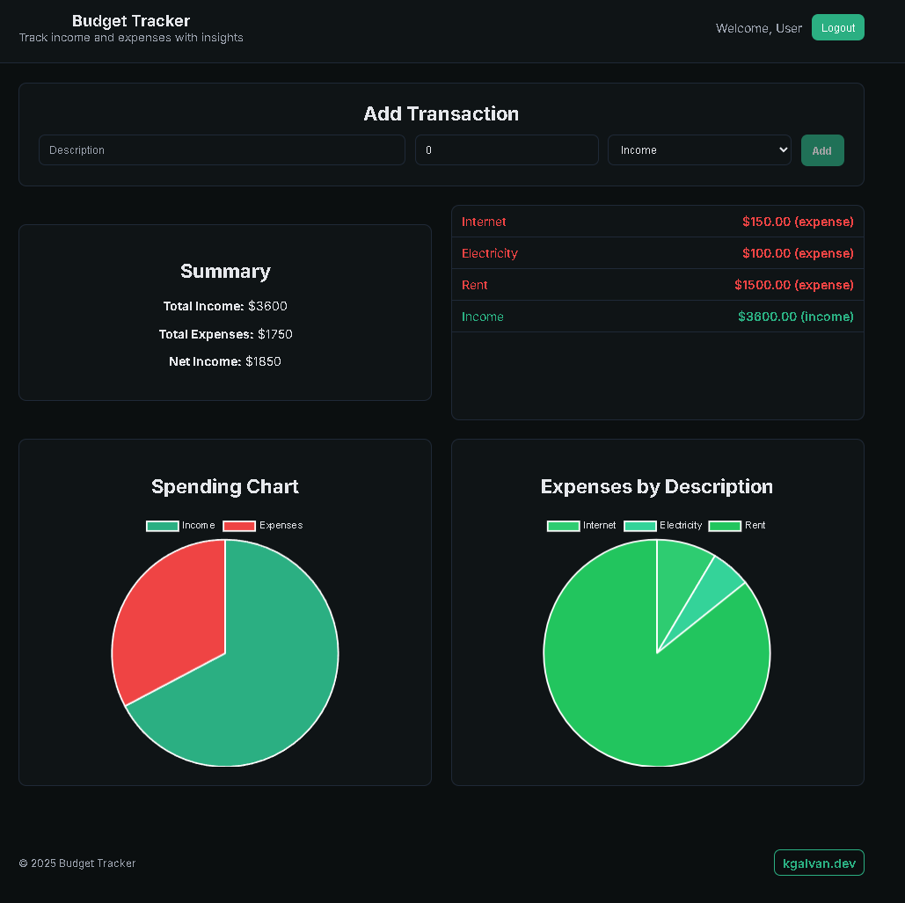

# Budget Tracker

Track income and expenses with clear summaries and charts. Built with a sleek, minimal green theme to evoke “money” without clutter.

- Live demo: https://budget-tracker.kgalvan.dev
- Tech: React (CRA), react-chartjs-2, Chart.js

## Features
- Add income and expense transactions
- LocalStorage persistence (survives refresh)
- Summary totals and net income
- Two charts: Income vs. Expenses and Expenses by Description
- Basic auth mock using LocalStorage (simple login/logout)
- Responsive layout + dark-mode support (prefers-color-scheme)

## Screenshot



## Getting started
Prereqs: Node.js 16+ recommended

Install and run dev server:

```bash
npm install
npm start
```

Open http://localhost:3000.

## Build

```bash
npm run build
```

Outputs static assets to `build/`.

## Deploy
Works well on Vercel, Netlify, or any static host.

- Vercel (CLI):
	```bash
	npm i -g vercel
	vercel
	vercel --prod
	```
- Netlify (CLI):
	```bash
	npm i -g netlify-cli
	netlify deploy --prod --dir=build
	```

Custom domain suggestion: `budget-tracker.kgalvan.dev`.

## Project structure (high level)
```
src/
	components/
		AuthForm.js
		Header.js
		TransactionForm.js
		TransactionList.js
		Summary.js
		IncomeExpenseChart.js
		ExpensesByDescriptionChart.js
	App.js
	index.js
	index.css
```

## Accessibility & UX
- High-contrast theme and clear focus rings
- Keyboard-friendly forms and buttons
- Charts with formatted tooltips and readable legends

## Roadmap
- Migrate to Vite for faster dev builds
- Add persistent backend storage (e.g., Postgres/Supabase)
- Export CSV / import transactions

## License
MIT

---

Built by [Kevin Galvan](https://kgalvan.dev) • [GitHub](https://github.com/kgalvanserrano)
